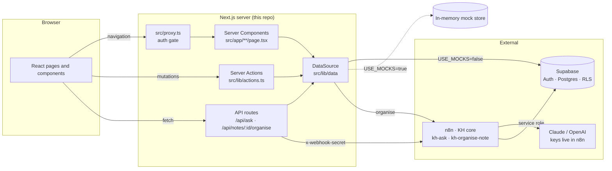
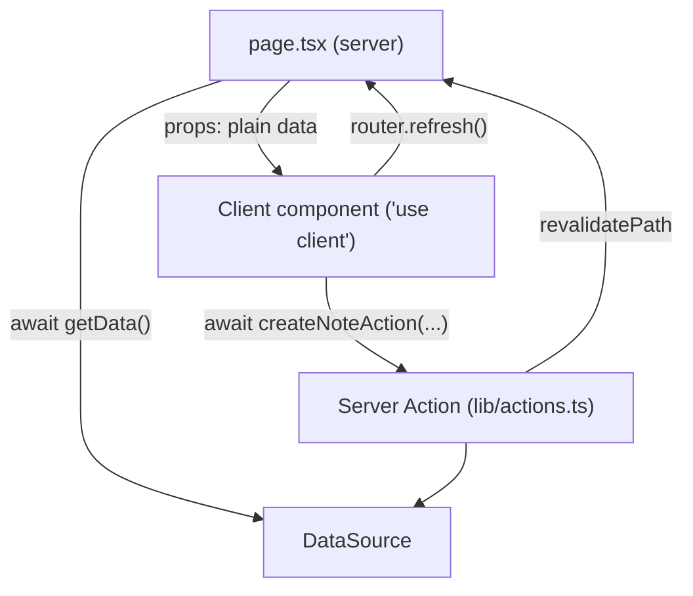
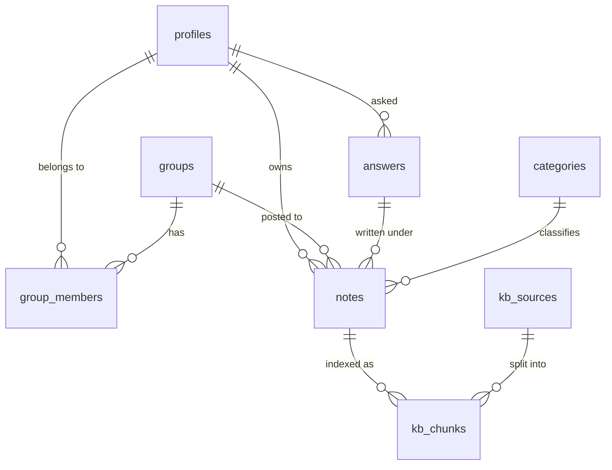

# NoteHive · Architecture

This guide explains how the `app/` codebase is organised and how its parts fit together. For step-by-step walkthroughs of what happens when a user does something, see [FLOWS.md](./FLOWS.md).

- **Product spec:** the Team Knowledge Hub PRD (v1.0). Requirement IDs such as `FR-ASK-04` in code comments refer to it.
- **Visual spec:** the Claude Design project "NoteHive" (Landing, S1–S4, Design System).

---

## 1. The big picture

NoteHive is a Next.js 16 (App Router) app. The browser never talks to AI providers or n8n directly. It talks only to this app's server, which then talks to Supabase (data and auth) and to n8n (AI workflows).



### Two modes

| | `USE_MOCKS=true` (default) | `USE_MOCKS=false` |
|---|---|---|
| Sign-in | "Continue with Google" sets a demo cookie and signs you in as *Aman Verma* | Supabase Google OAuth |
| Data | In-memory store seeded from the designs (`src/lib/data/mock.ts`) | Supabase Postgres, with every read and write checked by RLS |
| Answers | Canned topics that honour scope and access rules (`src/lib/mock/knowledge.ts`) | n8n `kh-ask` webhook, response validated with zod |
| Organising notes | Title, category and tags from a heuristic after about 2 s | n8n `kh-organise-note` webhook |

The mode is decided once, in `src/lib/config.ts`. Mocks are also forced on if the Supabase environment variables are missing, so a fresh clone always runs.

---

## 2. Folder map

```
app/
├── src/
│   ├── proxy.ts                  # Runs before every page: auth gate + Supabase session refresh
│   ├── app/                      # Routes (App Router)
│   │   ├── layout.tsx            # <html>, fonts, Providers (theme, toasts, mock flag)
│   │   ├── globals.css           # Design tokens (light/dark) → Tailwind theme
│   │   ├── not-found.tsx
│   │   ├── signin/page.tsx       # S1 · /signin?reason=ended|cancelled|failed
│   │   ├── auth/
│   │   │   ├── callback/route.ts # Google → Supabase code exchange
│   │   │   └── continuing/       # S1 · A2 "Signing you in…" interstitial
│   │   ├── api/
│   │   │   ├── ask/route.ts                  # POST /api/ask
│   │   │   └── notes/[id]/organise/route.ts  # POST /api/notes/:id/organise
│   │   └── (app)/                # Route group: pages that get the app shell when signed in
│   │       ├── layout.tsx        # Signed in → <AppShell>; signed out → bare page
│   │       ├── page.tsx          # "/" → Landing (signed out) or S2 Home (signed in)
│   │       ├── ask/new/page.tsx  # S3 loading (runs the ask)
│   │       ├── ask/[id]/page.tsx # S3 stored answer
│   │       ├── notes/page.tsx            # My notes
│   │       ├── notes/new/page.tsx        # S4 new note
│   │       ├── notes/[id]/page.tsx       # Note page / signed-out share gate
│   │       ├── notes/[id]/edit/page.tsx  # S4 edit note
│   │       ├── groups/[id]/page.tsx      # Group page + feed
│   │       ├── join/[code]/page.tsx      # Join link
│   │       └── profile/page.tsx
│   ├── components/               # UI (see §4)
│   └── lib/                      # Logic, no JSX (see §3)
├── supabase/
│   ├── migrations/0001_init.sql  # Tables, functions, triggers, RLS
│   └── seed.sql                  # Categories + default groups
├── .env.example
└── docs/                         # You are here
```

**Naming conventions**
- Files named `page.tsx`, `layout.tsx` and `route.ts` are Next.js conventions: a page, a shared wrapper, and an HTTP endpoint.
- A `(folder)` in parentheses groups routes without adding to the URL, so `(app)/notes/page.tsx` serves `/notes`.
- Files that start with `"use client"` run in the browser. Everything else runs on the server.

---

## 3. `src/lib`: the logic layer

| File | Responsibility |
|---|---|
| `types.ts` | Shared domain types: `Profile`, `Group`, `Note`, `Answer`, `Source` (library or note), `KeyPoint`, `NoteInput` |
| `categories.ts` | The fixed category list (PRD Appendix A) and `isCategory()` |
| `config.ts` | `USE_MOCKS`, `ASK_RATE_LIMIT_PER_HOUR`, the demo cookie name |
| `data/types.ts` | **The `DataSource` interface.** Every read and write the UI needs is listed here |
| `data/index.ts` | `getData()` returns the right `DataSource` for the current request (mock or Supabase). It's cached per request with React `cache()` |
| `data/mock.ts` | In-memory implementation. Seed data comes from the designs, and state lives on `globalThis` so it survives hot reloads |
| `data/supabase.ts` | Supabase implementation, which maps DB rows ↔ domain types and calls the RPC functions |
| `ask.ts` | `generateAnswer()`: calls n8n `kh-ask` and validates the reply, or runs the mock answer engine |
| `mock/knowledge.ts` | Canned topics, library docs and the mock organise heuristic |
| `n8n.ts` | `callN8n()`: a single place for webhook URLs, the shared secret header and the timeout |
| `actions.ts` | **Server Actions** (`"use server"`). All mutations from the UI: create/update/delete a note, retry organising, join/create a group, rename the profile, sign in/out |
| `rate-limit.ts` | `askBlockedUntil()` implements FR-ASK-11: 30 asks per hour |
| `api-error.ts` | `apiError(code, message)` produces the PRD 10.1 error format |
| `safe-next.ts` | `safeNext()` only allows same-site redirect targets after sign-in |
| `format.ts` | Dates ("2 h ago"), initials, greetings, note titles and excerpts |
| `use-draft.ts` | `useDraft()` client hook that keeps unsaved editor text in `localStorage` (FR-NOTE-10) |
| `supabase/server.ts` · `client.ts` · `admin.ts` | Supabase clients: the user session on the server, the browser (OAuth only), and the service role (inserting answers only) |

### Why a `DataSource` interface?

Pages, actions and API routes never import Supabase or the mock directly. They call `await getData()` and use the interface:

```ts
const data = await getData();
const [answer, groups] = await Promise.all([data.answer(id), data.myGroups()]);
```

This is what lets the whole UI run on mock data today and on Supabase later without changing a single component. To add a new capability, add a method to `data/types.ts` and implement it in both `mock.ts` and `supabase.ts`. TypeScript will flag any implementation you miss.

---

## 4. `src/components`: the UI layer

**Layout and shell**
- `app-shell.tsx`: `AppShell` holds the 248 px sidebar (the mobile drawer under 768 px) and the floating New note button. `TopBar` holds the page title, the compact Ask box (focus it with `/`), the theme toggle and New note.
- `landing.tsx`: the signed-out marketing page.
- `providers.tsx`: the theme (`next-themes`), the toast system, and the `useMockMode()` context.

**Design-system primitives**
- `ui.tsx`: `Icon` (Material Symbols), `btn()` class helper (primary/secondary/ghost/danger), `Logo`, `Avatar`, `cn()`
- `chips.tsx`: `VisibilityBadge`, `ScopeChip`, `CategoryChip`, `Tags`, `StatusChip` (Organising…, Couldn't organise, Member, Partly covered, New)
- `overlay.tsx`: `Dialog` (native `<dialog>`: focus trap and Esc for free) and `useDismiss()` (outside-click and Esc for popovers)
- `toast.tsx`: `useToast()` shows toasts with optional **Undo**, announced to screen readers
- `theme-toggle.tsx`, `greeting.tsx`, `markdown.tsx` (safe Markdown rendering; raw HTML is never rendered)

**Feature components**

| Component | Used on | What it does |
|---|---|---|
| `question-box.tsx` | Home | `QuestionBox` (Enter to ask, Shift+Enter for a new line, 3–500 characters) and `ScopeSelector` |
| `ask-runner.tsx` | `/ask/new` | Calls `POST /api/ask`, shows the two-stage progress and Cancel, then redirects to `/ask/<id>` |
| `answer-view.tsx` | `/ask/[id]` | The summary, Key points, the partial/none coverage states, Copy / Ask again, and the inline note composer |
| `citations.tsx` | Answer | `Citation` marker with a popover, `CitedText` (turns `[n]` into markers), `CreditRow`, `JoinGroupButton` |
| `markdown-editor.tsx` | Composer, editor | Write/Preview tabs, toolbar, counter, and errors for an empty or over-long body |
| `visibility.tsx` | Composer, editor, note page | `VisibilitySegmented` (Group ▾ / Private) and the helper text |
| `note-composer.tsx` | Answer, group page | Inline "Add a note" / "Post a note", plus `DraftBanner` |
| `note-editor.tsx` | `/notes/new`, `/notes/[id]/edit` | The full S4 editor, including title, category and tags in edit mode |
| `note-view.tsx` | `/notes/[id]` | Reading a note, plus owner actions: visibility with Undo, Edit, Delete with a confirmation |
| `note-card.tsx` | Home, My notes, feed | `FeedNoteCard` and `MyNoteCard`, which shows the organising/failed states |
| `my-notes.tsx` | `/notes` | Search, tabs, filters, pagination |
| `group-dialogs.tsx` | Sidebar, group page | `CreateGroupDialog`, `JoinCodeDialog`, `InviteBlock` |
| `group-feed.tsx` | Group page | Category filter, periodic refresh, highlighting of newly arrived notes |
| `retry-organise.tsx` | Cards, note page | `RetryOrganise` button and `OrganisePoller`, which refreshes while a note is organising |
| `google-button.tsx` | Landing, sign-in | Starts OAuth, or the demo sign-in in mock mode |

### Server vs client components

Pages are **Server Components**. They run on the server, read data through `getData()`, and pass plain objects down. Anything with state, event handlers or browser APIs is a **Client Component** (`"use client"`). Client components change data by calling **Server Actions** from `lib/actions.ts`, then call `router.refresh()` so the server re-renders with the new data.



---

## 5. Styling and the design system

- **Tokens** live in `src/app/globals.css`, copied from the NoteHive Design System: `:root` for light and `.dark` for dark. Tailwind exposes them as utilities:

  | Token | Tailwind class examples |
  |---|---|
  | `--bg`, `--surface`, `--surface-2/3` | `bg-bg`, `bg-surface`, `bg-surface-2` |
  | `--border`, `--border-strong` | `border-line`, `border-line-strong` |
  | `--text`, `--text-2`, `--text-3` | `text-ink`, `text-ink-2`, `text-ink-3` |
  | `--accent`, `--accent-ink`, `--accent-text`, `--accent-soft`, `--accent-border` | `bg-accent text-accent-ink`, `text-accent-text`, `bg-accent-soft` |
  | `--success`, `--warning`, `--error` (+ `-soft`) | `text-error bg-error-soft` |
  | radii 6/8/12/16 | `rounded-chip`, `rounded-control`, `rounded-card`, `rounded-dialog` |

  The color names `line` and `ink` avoid awkward class names like `border-border` or `text-text`.
- **Fonts:** Geist is used for the interface, Source Serif 4 (`font-read`) for answers and note bodies, and Geist Mono for paths, codes and counters. Icons come from Material Symbols Rounded.
- **Theme:** `next-themes` toggles the `.dark` class. The default follows the operating system.
- **Focus:** a global 2 px `--focus` outline sits in `@layer base`. Text fields opt out with `outline-none`, because their container shows focus instead.

---

## 6. Data model and access rules

`supabase/migrations/0001_init.sql` implements PRD section 9.



**Access rules, enforced in the database by RLS:**
- You can read a note if you own it or if it is a group note.
- You can post to a group only if you're a member.
- Only the owner can edit or delete a note.
- Answers are visible only to the person who asked.
- `kb_chunks` and `kb_sources` are service-role only.

The mock store applies the same rules in code (`canRead`, `isMember`), so the demo behaves the same way.

**Database functions:**
- `is_group_member`
- `create_group` (generates a 6-character code without the ambiguous characters O, I, 0 and 1)
- `join_group` and `join_group_by_id`
- `my_groups`
- `note_answer_question`
- `match_chunks_for_user` (service only; used by n8n)

**Triggers:**
- New auth user: creates a profile and adds the user to the default group.
- Visibility or group changes on a note: synced to the note's chunks.
- A user editing a note's title, category or tags: sets `meta_locked`, so AI organising won't overwrite them.
- Any note update: sets `updated_at`.

---

## 7. Configuration

| Variable | Used by | Purpose |
|---|---|---|
| `USE_MOCKS` | everywhere | `true` = demo mode (default) |
| `NEXT_PUBLIC_SUPABASE_URL`, `NEXT_PUBLIC_SUPABASE_ANON_KEY` | proxy, server and browser clients | Supabase project |
| `SUPABASE_SERVICE_ROLE_KEY` | `/api/ask` only | Inserting answers (RLS reserves this for the server) |
| `N8N_BASE_URL`, `N8N_WEBHOOK_SECRET` | `lib/n8n.ts` | Calling n8n |
| `N8N_ASK_WEBHOOK`, `N8N_ORGANISE_WEBHOOK` | `lib/n8n.ts` | Webhook names (default `kh-ask`, `kh-organise-note`) |
| `ASK_RATE_LIMIT_PER_HOUR` | `lib/rate-limit.ts` | Default 30 |

---

## 8. Common changes: where to look

| I want to… | Start in |
|---|---|
| Change colours, radii or fonts | `src/app/globals.css`, `src/app/layout.tsx` |
| Add a page | `src/app/(app)/<route>/page.tsx` (it gets the shell automatically). If it must be public, add it to `needsAuth()` in `src/proxy.ts` |
| Add a data operation | `lib/data/types.ts` → implement in `mock.ts` and `supabase.ts` → call it from a page or action |
| Add a mutation button | Add a Server Action in `lib/actions.ts`, call it from a client component, then `router.refresh()` |
| Change what the mock answers | `src/lib/mock/knowledge.ts` → `TOPICS` |
| Change the n8n contract | `src/lib/ask.ts` (zod schema `n8nAnswer`), `src/lib/n8n.ts` |
| Change DB schema or rules | Add a new file in `supabase/migrations/` (don't edit `0001` once it's applied) |
