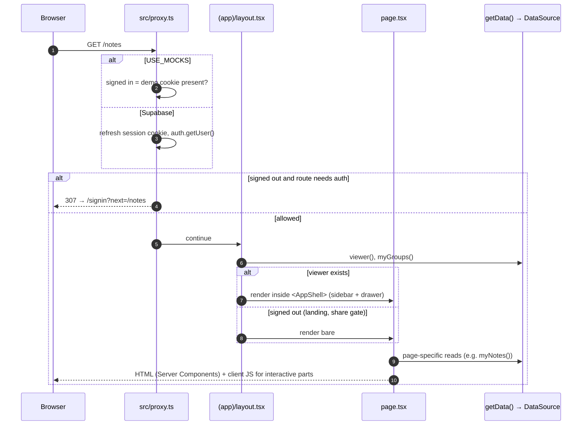
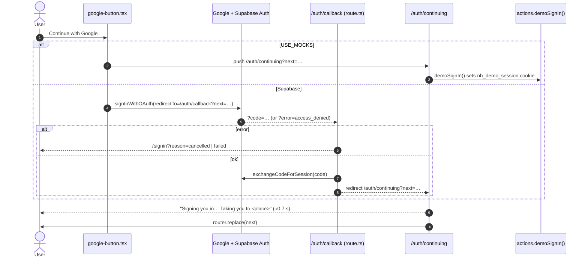
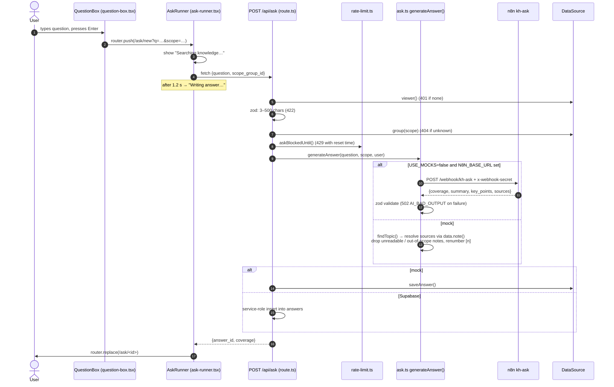
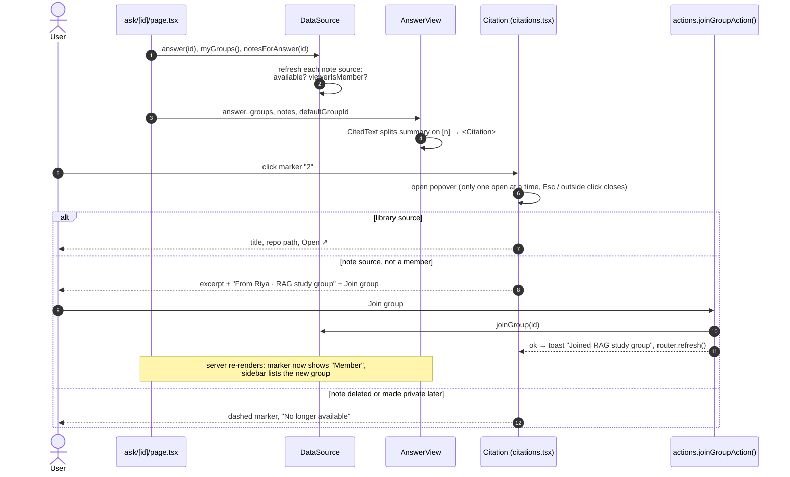
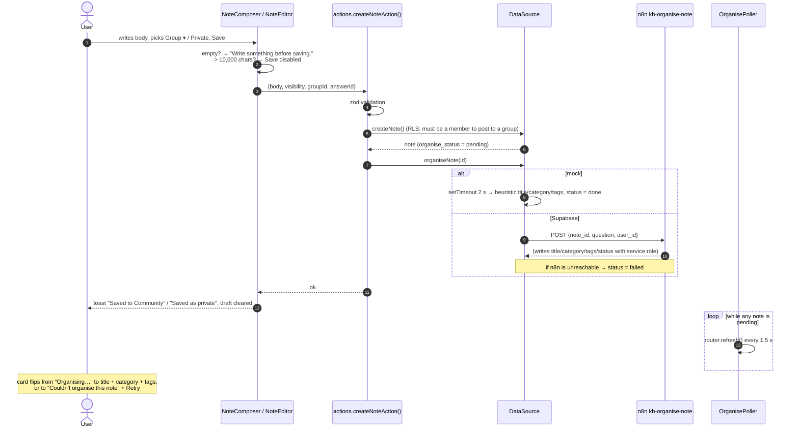
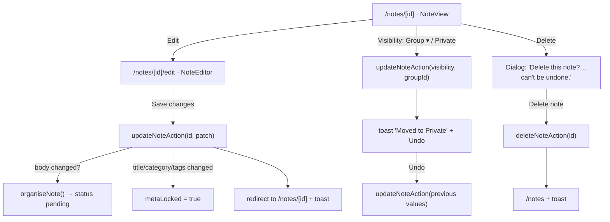
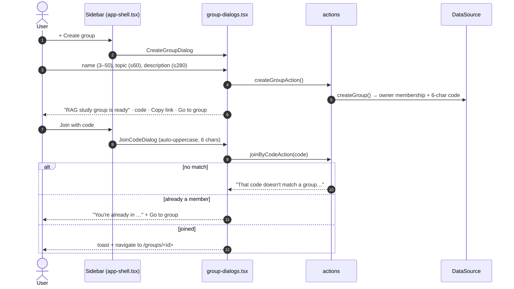

# NoteHive · Code flows

These walkthroughs follow what happens in the code for each user action, file by file. Read [ARCHITECTURE.md](./ARCHITECTURE.md) first for the map of the codebase.

**Contents**
1. [Every page request](#1-every-page-request)
2. [Signing in](#2-signing-in)
3. [Asking a question](#3-asking-a-question)
4. [Reading an answer: citations and Join group](#4-reading-an-answer-citations-and-join-group)
5. [Saving a note and AI organising](#5-saving-a-note-and-ai-organising)
6. [Editing a note, changing visibility, deleting](#6-editing-a-note-changing-visibility-deleting)
7. [Groups: create, join, feed](#7-groups-create-join-feed)
8. [Drafts that survive a reload](#8-drafts-that-survive-a-reload)
9. [Errors and limits](#9-errors-and-limits)

---

## 1. Every page request

Every page navigation passes through the same three layers before a component renders.



**Where the rules live**
- **Public routes:** `needsAuth()` in `src/proxy.ts` lets through `/`, `/signin`, `/auth/*` and `/notes/<id>`. The note page shows its own sign-in gate.
- **One DataSource per request:** `getData()` is wrapped in React `cache()`, so a layout and a page share it within a request.
- **`/` renders two different pages:** `(app)/page.tsx` renders `<Landing>` when there's no viewer and Home when there is one.

---

## 2. Signing in

Sign-in is Google only (S1). The button never shows a form. It goes straight to Google, or to the demo sign-in in mock mode.



- **Destination:** `next` is checked by `safeNext()`, so a crafted link can't send users to another site.
- **Interstitial label:** `/auth/continuing/page.tsx` works out the destination name shown on screen: "Home", a note's title, "your answer", and so on.
- **New users (Supabase):** the `handle_new_user` trigger creates the profile and adds the user to the default group, **Community**.
- **Signing out:** `actions.signOut()` clears the cookie (mock) or calls `auth.signOut()`, then redirects to `/`.

---

## 3. Asking a question

This covers Home (S2) through the loading state of the Answer screen (S3) to the stored answer.



**Details worth knowing**
- **Cancel:** `AbortController.abort()` on the fetch. The UI shows "Stopped. Nothing was saved." with an Ask again button.
- **Strict Mode:** React runs effects twice in development. `AskRunner` tracks a `started` ref so only one request is sent per attempt.
- **Grounding in the mock:** a sentence or key point is kept only if **all** of its citations survived the access and scope filter. If any source was dropped, coverage becomes `partial`, and if nothing matched it's `none`. Nothing is ever invented.
- **Ask history:** `/ask/<id>` reads the stored answer, so reopening an item from Recent questions never calls the AI again (FR-ASK-10). "Ask again" starts a fresh `/ask/new`.

---

## 4. Reading an answer: citations and Join group



- **Marker styles:** note sources use the tinted marker, library sources the neutral one, and unavailable sources a dashed one. Each marker is a `<button>` named "Source n: Title" for screen readers.
- **Copy:** builds plain text containing the summary, key points and the source list, then writes it to the clipboard (FR-ASK-12).

---

## 5. Saving a note and AI organising

Notes are **saved first and organised afterwards**, so a failed AI call can never lose a note (NFR-04).



- **Retry:** `RetryOrganise` calls `retryOrganiseAction()`, which calls `organiseNote()` again.
- **A newer save wins:** the mock organiser checks `updatedAt` and discards stale runs (PRD section 15).
- **Manual edits are kept:** if the owner has edited the title, category or tags, `metaLocked` is set, and organising keeps those values instead of overwriting them.
- **Where the composers appear:**
  - under every answer, linked through `answerId`
  - on group pages, fixed to that group ("Post a note to this group")
  - at `/notes/new`, which takes `?answer=` for "Write the first note on this" and `?group=`

---

## 6. Editing a note, changing visibility, deleting



- **Owner only:** only the owner sees Edit, the visibility control and Delete. Anyone else visiting `/notes/<id>/edit` gets a 404.
- **Title, category and tags** become editable only once the note is organised.
- **Visibility changes and deletes apply to answers immediately.** In Supabase, the `notes_sync_chunks` trigger updates the search index, and a delete cascades to the note's chunks. Answers that cited the note show it as "No longer available".

---

## 7. Groups: create, join, feed



- **Join links:** `/join/<code>` calls `joinByCode()` on the server and redirects to the group.
- **The group page shows:**
  - the header with an Owner or Member chip
  - the invite code block (members only)
  - "Ask within this group", which links to `/?scope=<id>` and preselects the scope on Home
  - the composer, or "Join to post here" for non-members
  - `GroupFeed`
- **The feed:** `GroupFeed` refreshes every 15 s and highlights newly arrived notes. In production this would use Supabase Realtime (FR-GRP-06).

---

## 8. Drafts that survive a reload

`useDraft(key, initial)` in `src/lib/use-draft.ts` implements FR-NOTE-10:

1. **On mount:** it reads `localStorage[key]`. If there's a non-empty draft that differs from the saved text, it restores it and shows the **"Restored unsaved draft from today, 14:31"** banner with Discard.
2. **On change:** a 300 ms debounce, then `localStorage.setItem(key, {body, at})`. If the text is empty or equals the saved version, the entry is removed instead.
3. **On save or cancel:** `clear()` removes the draft.

Draft keys are namespaced by context. Examples: `nh-draft:answer:<id>`, `nh-draft:note:<id>`, `nh-draft:group:<id>`, `nh-draft:new:…`

---

## 9. Errors and limits

| Situation | Where it's handled | What the user sees |
|---|---|---|
| Not signed in on a protected page | `proxy.ts` | Redirect to `/signin?next=…` |
| Session ended during an ask | `AskRunner` (401) | `/signin?reason=ended` |
| Question < 3 or > 500 chars | `QuestionBox` + zod in `/api/ask` | Nothing is submitted, or an inline message |
| 30 asks in an hour | `rate-limit.ts` → Home + `/api/ask` (429) | Ask is disabled and the banner reads "You can ask again at 14:05." |
| AI timeout or bad output | `/api/ask` (504/502) | "Couldn't get an answer. Try again." + Retry |
| Knowledge base doesn't cover it | `coverage: "none"` (normal 200) | "The knowledge base doesn't cover this yet" + Write the first note |
| Only partly covered | `coverage: "partial"` | Warning note + "Add a note on the gap" |
| Posting to a group you're not in | RLS / mock `Forbidden` → `actions.fail()` | "You can only post to groups you're a member of." |
| Note private or deleted | `data.note()` returns null | "This note is private or no longer exists." |
| Organising failed | `organise_status = failed` | "Couldn't organise this note" + Retry |

All API errors use a single shape (`src/lib/api-error.ts`, PRD 10.1):

```json
{ "error": { "code": "RATE_LIMITED", "message": "You can ask again at 14:05.", "retry_after_s": 540 } }
```
